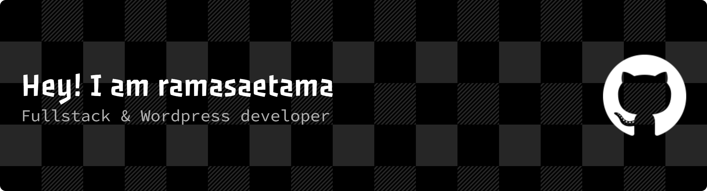

## Hi there Im Ramasaetama👋

<!--
**ramasaetamaa/ramasaetamaa** is a ✨ _special_ ✨ repository because its `README.md` (this file) appears on your GitHub profile.

Here are some ideas to get you started:

- 🔭 I’m currently working on ...
- 🌱 I’m currently learning ...
- 👯 I’m looking to collaborate on ...
- 🤔 I’m looking for help with ...
- 💬 Ask me about ...
- 📫 How to reach me: ...
- 😄 Pronouns: ...
- ⚡ Fun fact: ...
-->

  

- 🔭 I’m currently part of the Front-End Web & Back-End with AI cohort at **Asah led by Dicoding**
- 🌱 I’m currently learning [**React**](https://react.com) Framework

##### My Skills

	
	
	
	
	
	
	

##### Connect with me

 

##### My Github Stats

<!-- Centered, responsive GIF — use width attribute to avoid overlapping text. -->

	

